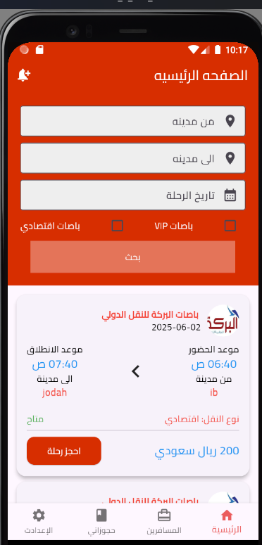

# Terhal - Unified Booking Platform for Transport Companies

**Terhal** is a mobile application that streamlines the booking process by aggregating multiple transportation companies into a single platform. It enables users to browse available trips, compare options, and book directly with ease.

# structures project

```
/lib
│── main.dart # Main entry point of the application
│
├── core # Core files and essential structures
│ ├── api # API communication management
│ ├── constant # Definition of global constants like colors and routes
│ ├── localization # Language and localization management
│ ├── my_classes # General classes used in the project
│ ├── my_function # Utility functions and helpers
│ ├── services # Services such as database communication
│
├── controller # Application control and data interaction
│
├── data # Data sources
│ ├── models # Data models (Product, User, Order, etc.)
│ ├── remote # Handling data retrieval from servers or APIs
│
├── view # User Interface
│ ├── screen # Main application screens (Home, Cart, Profile, etc.)
│ ├── widget # Reusable UI components
```

## 🛠️ Technologies & Libraries Used

- **GetX** – For state management and navigation.
- **Firebase Auth** & **Google Sign-In** – For user authentication.
- **Firebase Core** – To integrate with Firebase services.
- **Mapbox**, **Geolocator**, **Geocoding** – For location services and map integration.
- **Shared Preferences** – For local storage and caching.
- **HTTP** – For handling RESTful API requests.
- **Image Picker** & **Cached Network Image** – For selecting and displaying images efficiently.
- **Dartz** – For functional programming patterns (e.g., Either, Option).
- **Carousel Slider** & **Smooth Page Indicator** – For interactive UI sliders.
- **Lottie** – For rendering vector animations.
- **Internet Connection Checker** – For monitoring network connectivity.
- **flutter_dotenv** – For loading environment variables from a `.env` file.

## 🔗 Backend Repository

The backend (Django) project is available in a separate repository:

➡️ **[View Backend Repository](https://github.com/almlyky/backend_django_travelApp.git)**

## readme_image

### Home

<p align="center">
  
</p>
